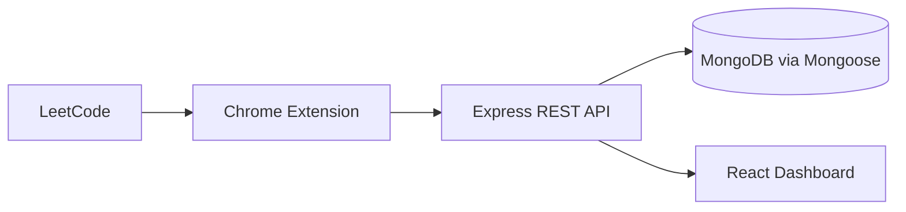

# DSA Tracker

Phase 1 is a React + Express + MongoDB monorepo that automatically records accepted LeetCode submissions through a Chrome Manifest V3 extension.

## Architecture



## Phase 1 structure

- `frontend/` React, TypeScript, Vite dashboard
- `backend/` Express API, authentication, Mongoose persistence
- `extension/` Manifest V3 content script, service worker, popup
- `database/` MongoDB model notes and indexes (added in Step 2)

## Quick start

```bash
npm install
Copy-Item .env.example .env
docker compose up -d mongodb
npm run dev
```

The API health check is available at `http://localhost:5000/api/health`; the frontend runs at `http://localhost:5173`.

## Planned dependencies

Express and Zod provide the small REST API and validation layer; Mongoose and MongoDB provide persistence; bcryptjs and JWT provide authentication primitives; React Router supports frontend routes; Chrome's MV3 APIs provide extension storage, messaging, and background execution.
